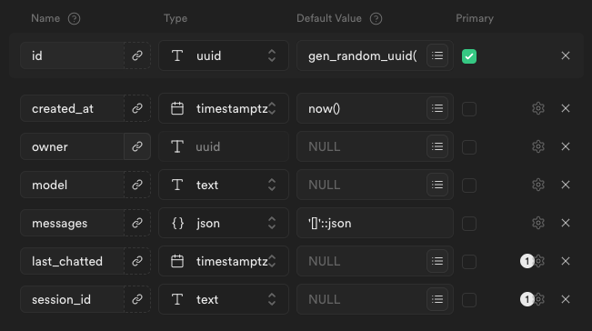
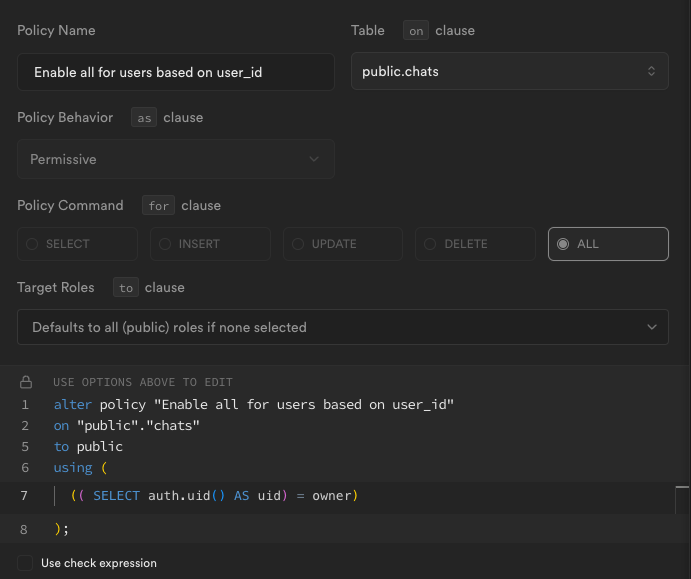

# MultiAgent

[🎥 Video demo](https://youtu.be/XVZFZJgEtfA)

Autonomous Web Browsing AI Agent with Vision - powered by MultiOn

_As of May 6, MultiOnChat is now MultiAgent and frontend and backend repositories have been merged!_

## Local setup 💻

### Prerequisites

- git
- Python 3.11
- pipenv
- Node 21
- pnpm

### Clone repository

1. Clone this GitHub respository:

```bash
git clone https://github.com/justinsunyt/multiagent.git
```

### Create Supabase project

1. Create an account on [Supabase](https://supabase.com/) if you don't have one already.

2. Create a project.

3. In <b>Table Editor</b>, create a table called `chats` with the following columns:

<br/>

Make sure `last_chatted` and `session_id` are nullable.

4. Create the following auth policy for `chats`:

<br/>

5. In <b>Authentication -> Providers</b>, enable `Email` as an auth provider.

### Launch backend

1. Navigate to the `backend/` folder:

```bash
cd backend
```

2. Create a .env file in the `backend/` folder and store the following variables:

```bash
SUPABASE_URL="<Supabase project URL>"
SUPABASE_KEY="<Supabase anon key>"
SUPABASE_JWT_SECRET="<Supabase JWT secret>"
SUPABASE_JWT_ISSUER="<Supabase project URL>/auth/v1"
REPLICATE_API_TOKEN="<Replicate API token>"
GROQ_API_KEY="<Groq API key>"
MULTION_API_KEY="<Multion API key>"
```

3. Launch pipenv environment:

```bash
pipenv shell
```

4. Install required packages:

```bash
pipenv install
```

5. Run the FastAPI development server:

```bash
uvicorn main:app --reload
```

### Launch frontend

1. Navigate to the `frontend/` folder:

```bash
cd frontend
```

2. Create a .env.local file in the `frontend/` folder and store the following variables:

```bash
NEXT_PUBLIC_SUPABASE_URL="<Supabase project URL>"
NEXT_PUBLIC_SUPABASE_ANON_KEY="<Supabase anon key>"
NEXT_PUBLIC_PLATFORM_URL="<localhost:8000 or deployed backend URL>"
```

3. Install required packages:

```bash
pnpm install
```

4. Run the Next.js development server:

```bash
pnpm dev
```

Finally, open [http://localhost:3000](http://localhost:3000) with your browser to start using MultiAgent!

## Tech stack ⚙️

- Client: Next.js, TanStack Query
- UI: Tailwind, shadcn/ui, Framer Motion, Lucide, Sonner, Spline
- Server: FastAPI
- Database: Supabase
- AI: MultiOn, Replicate, Groq

## Features 🔍

- Autonomously browse the internet with your own AI agent using only an image and a command - order a Big Mac, schedule events, and shop for outfits!
- Supabase database and email authentication with JWT token verification for RLS storage
- Currently supports llama3-70b, llava-13b, lava-v1.6-34b, qwen-vl-chat

## What's next? 💪

- Merge frontend and backend repos!
- Llama tool calling to activate agent whenever appropriate
- Refine image prompt recursively with Llama
- Pause button to interrupt agent and prompt new command
- Chat selection menu to choose between any combination of LLMs and VLMs
- Deploy! (You will have to use your own API keys)

## Credits 🙏

Special thanks to [MultiOn](https://www.multion.ai/) for the epic agent package and [auroregmbt](https://community.spline.design/file/3ff7b617-2fe9-46c7-8e06-b6d7c382f4db) for the Spline animation!
